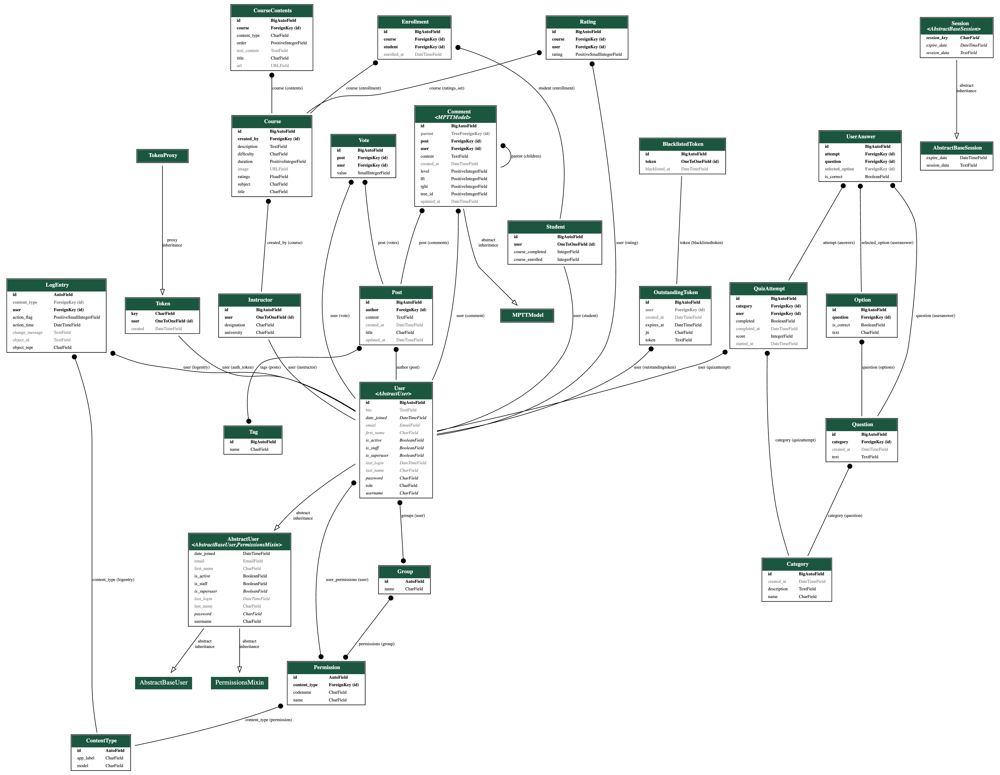

# KUETx

**Empowering the Future of Online Learning**  
Seagull is a full-stack Learning Management System (LMS) built for Learnathon. It enables educators to manage courses and learners to access interactive, community-driven education in one seamless platform.

---

<div align="center">

[](https://reactjs.org)
[](https://vitejs.dev)
[](https://www.djangoproject.com)
[](https://www.python.org)
[](https://www.postgresql.org)
[](https://git-scm.com)

[](https://huggingface.co)

</div>

---

## 🌐 Live Demo

<p align="center">
  <a href="https://seagull-lms.netlify.app/" target="_blank">
    
  </a>
</p>

## 👨‍💻 Team

Meet the passionate developers behind **KUETx**:

| Role      | Name & GitHub Profile                               |
| --------- | --------------------------------------------------- |
| Team Lead | [Imamul Islam Ifti](https://github.com/ImamIfti056) |
| Developer | [Saif Alvi](https://github.com/yuusaif)             |
| Developer | [syed Nazib Sadi](https://github.com/SyedSadi)      |

---

### 🧠 Our Guide & Mentor

A heartfelt appreciation to **[Maahad Mahmud](https://github.com/maahad767)**

---

## 📚 Features

## 📘 Student Course Interaction

- 🔍 **Browse Available Courses**  
  Students can explore and enroll in courses based on topics or tags.

- 📺 **Watch Lessons**  
  Access embedded YouTube videos or uploaded lecture content within a clean viewer.

- 📄 **Download Materials**  
  Get access to slides, PDFs, and supplementary resources for offline learning.

- ✅ **Track Progress**  
  Visual indicators mark completed lessons and materials.

- 🧪 **Attempt Quizzes**  
  Participate in course quizzes with instant feedback and scoring.

---

## 🧠 Interactive Quizzes & Evaluation

- ⏱️ **Timed Quiz Sessions**  
  Students take quizzes under time constraints, simulating real test conditions.

- 🧮 **Auto-Graded Scoring**  
  Quiz submissions are automatically evaluated with instant feedback.

- 🧾 **Detailed Result Breakdown**  
  Students receive question-wise analysis, showing correct answers.

- 📈 **Progress Tracking**  
  Quiz performance is recorded and reflected in the student's profile

- 🔄 **Re-attempts & Practice**  
  Instructors can allow multiple attempts for practice and learning reinforcement.

---

## 💬 Interactive Discussion Forum

- 🗨️ **Threaded Conversations**  
  Students can create and reply to posts in a structured, thread-based layout.

- 🧠 **Course-Specific Discussions**  
  Forums are tied to individual courses, keeping topics relevant and organized.

- 🧹 **Toxicity Detection**  
  Posts are scanned in real-time using Hugging Face’s `unitary/toxic-bert` to prevent harmful or offensive content.

- 👍 **Voting & Tagging**  
  Posts can be upvoted and tagged, helping highlight important or useful discussions.

---

## 📊 Dashboards & Analytics

Insightful data visualization for both learners and instructors to monitor performance and progress.

---

## 🔐 Secure Authentication

Modern JWT-based authentication flow for registration, login, and protected APIs.

---

## 🧪 Scalable Backend

Modular Django REST framework structure with clean API architecture and future-ready integration hooks.

## 🏗️ System Architecture

> Diagram shows how users interact through the frontend with DRF APIs for different modules including courses, quizzes, forums, and authentication.


---

## 📃API Documentation

Explore our RESTful API with interactive docs powered by drf-spectacular:

[](https://seagull-production.up.railway.app/api/schema/swagger-ui/)

## 🗂️ Entity-Relationship Diagram

Here’s an overview of the system’s data structure:



## 📂 Project Directory Structure

Here’s the directory structure of the **Seagull LMS** project:

```
seagull
├── frontend
│   ├── public
│   │   └── assets
│   ├── src
│   │   ├── assets
│   │   ├── components
│   │   │   ├── admin
│   │   │   ├── courses
│   │   │   ├── forum
│   │   │   ├── landingpage
│   │   │   ├── profile
│   │   │   ├── quiz
│   │   │   └── shared
│   │   ├── pages
│   │   ├── services
│   │   └── context
├── server
│   ├── requirements.txt
│   └── backend
│       ├── ai_utils
│       ├── course
│       ├── quiz
│       ├── forum
│       ├── user
├── README.md
├── LICENSE
└── .github
    └── workflows
```

## 🚀 Getting Started

**Clone the repository:**

```bash
git clone https://github.com/your-username/seagull.git
cd seagull
```

## 🧩 Frontend Setup

```bash
cd frontend
npm install       # install dependencies
npm run dev       # run the app at localhost
```

## 🐍 Backend Setup

```bash
cd server
python -m venv env       # create virtual environment
source env/bin/activate  # activate environment (Linux/macOS)
env\Scripts\activate     # for Windows

pip install -r requirements.txt
cd backend
python manage.py migrate
python manage.py createsuperuser  # follow prompts
python manage.py runserver
```

## 🤝 Contributing

We welcome contributions! Here's how you can help:

1. Fork this repository
2. Create a new branch: `git checkout -b feature-name`
3. Make your changes and commit: `git commit -m 'Add new feature'`
4. Push to your fork: `git push origin feature-name`
5. Submit a Pull Request

> 💡 For major changes, please open an issue first to discuss what you'd like to change.

## 📄 License

This project is licensed under the MIT License - see the [LICENSE](LICENSE) file for details.

## 🙏 Acknowledgments

- Special thanks to our mentor [@maahad767](https://github.com/maahad767)
- All contributors who have helped shape this project

---

<p align="center">Made with ❤️ by Team Seagull</p>
